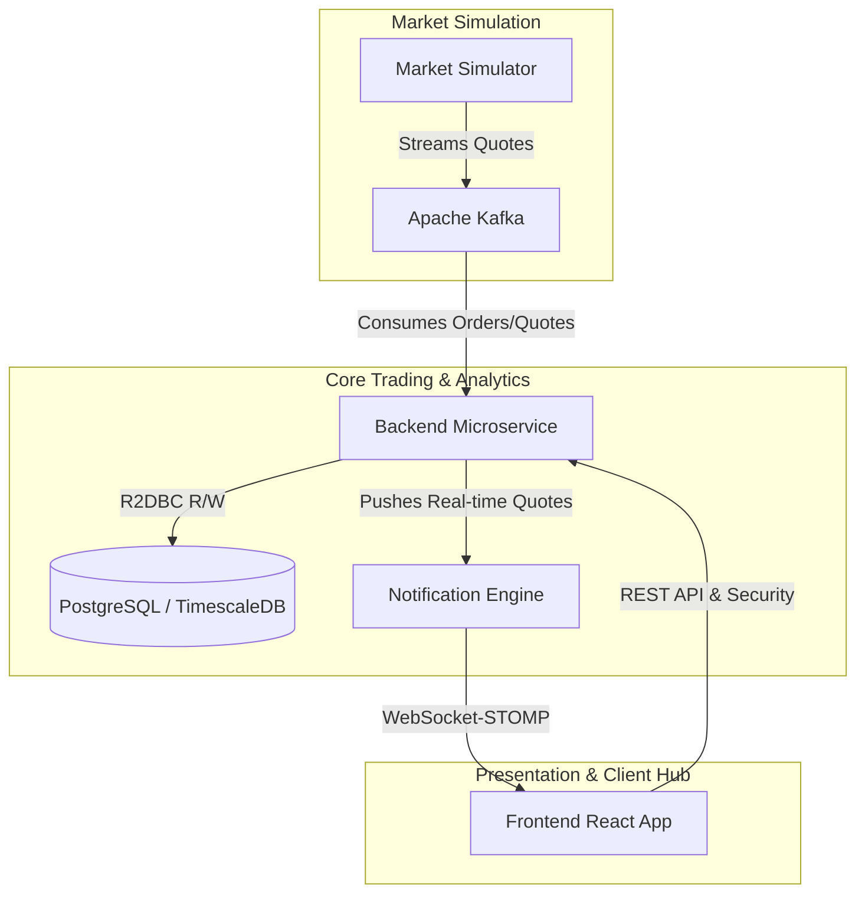

# 🚀 FinPulse — Live High-Frequency Trading & Market Analytics Dashboard

FinPulse is a modern, state-of-the-art, high-frequency reactive fintech analytics dashboard. It combines reactive streaming backend services, event-driven streaming with Apache Kafka, real-time WebSockets, and a premium React Dashboard to deliver instantaneous trading and market intelligence.

---

## 🏗️ Architecture & Component Overview

FinPulse is built as an event-driven microservices architecture:



### 📦 Applications Hierarchy (`/apps`)

*   **`backend`**
    *   **Tech Stack:** Spring Boot 4.0.6, Spring Security Reactive, Spring WebFlux, OAuth2/JWT, Spring Data R2DBC, Apache Kafka, Reactive Redis.
    *   **Description:** The high-performance transaction ledger and trade execution coordinator. Uses non-blocking R2DBC database operations and handles security, token management, and event-driven logging.
*   **`market-simulator`**
    *   **Tech Stack:** Spring Boot 3.5.14, Spring Kafka, Spring WebFlux.
    *   **Description:** High-frequency mock market generator producing real-time trade execution streams and order book updates directly into Apache Kafka.
*   **`notification-engine`**
    *   **Tech Stack:** Spring Boot 3.5.14, Spring MVC WebSocket & STOMP, Spring Kafka.
    *   **Description:** Real-time event broker that consumes processed trades from Kafka and pushes them instantly to client applications over secure WebSockets using STOMP protocol.
*   **`frontend`**
    *   **Tech Stack:** React 18, TypeScript, Zustand/Redux Toolkit, Recharts / ApexCharts.
    *   **Description:** A premium, responsive glassmorphic dark-mode dashboard showcasing sub-second tickers, streaming candlestick charts, trade ticket executing forms, and a ledger log.

---

## 🛠️ Technology Stack & Dev Ecosystem

*   **Core Systems:** Java 21, Node.js 20+, Docker
*   **Databases:** PostgreSQL (with TimeScaleDB extensions for high-density financial time-series metrics), Redis Cache
*   **Event Broker:** Apache Kafka / Confluent Cloud
*   **E2E Testing:** Playwright TypeScript test automation
*   **Infra & GitOps:** Dual Cloud Terraform modules (AWS EKS & GCP GKE), Helm umbrella charts, ArgoCD git-based release deployments.

---

## 🚀 Getting Started Locally

### 1. Prerequisites
Ensure you have the following installed on your machine:
*   [Java 21 JDK](https://adoptium.net/temurin/releases/?version=21)
*   [Maven 3.9+](https://maven.apache.org/)
*   [Node.js 20+](https://nodejs.org/)
*   [Docker Desktop](https://www.docker.com/products/docker-desktop/)

### 2. Running the Infrastructure (Docker Compose)
From the root folder, launch the databases and message broker infrastructure:
```bash
docker compose -f infra/docker-compose.yml up -d
```
This boots:
*   PostgreSQL (R2DBC Data Repository)
*   Apache Kafka & Zookeeper (Real-time Event Streaming)
*   Redis (Session & Token Cache)

### 3. Launching Backend Microservices
Open separate terminal instances for each application under `apps/` and run the Spring Boot applications:

*   **Backend:**
    ```bash
    cd apps/backend
    mvn spring-boot:run
    ```
*   **Market Simulator:**
    ```bash
    cd apps/market-simulator
    mvn spring-boot:run
    ```
*   **Notification Engine:**
    ```bash
    cd apps/notification-engine
    mvn spring-boot:run
    ```

### 4. Running the Frontend React App
Navigate to the frontend application directory, install dependencies, and start the development server:
```bash
cd apps/frontend
npm install
npm run dev
```

---

## 🧪 Testing & Verification

### Backend Unit & Integration Testing
Run the comprehensive Spring integration suite using JUnit 5 and Testcontainers:
```bash
cd apps/backend
mvn clean test
```

> [!NOTE]
> Integration tests automatically spin up isolated PostgreSQL instances inside Docker using Testcontainers to validate the R2DBC repository and transaction pipeline.

### E2E Dashboard Testing
Playwright E2E UI testing can be run against local or staging instances:
```bash
# Set up Playwright dependencies
npm install

# Run E2E automation tests
npx playwright test
```

---

## 🛠️ Roadmap & Progress Checklist

See the interactive [task-tracker.md](file:///f:/FinPulse/tasks/task-tracker.md) to inspect the roadmap progress, Sprint logs, and backlogs.

---
*Created with care by the FinPulse Core Engineering Team.*
